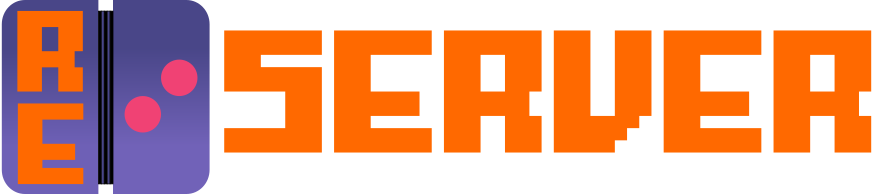

  

> [!NOTE]
> **This is not an officially supported Ntrome Ltd. or Infrared5 Inc. product.**

# Retouched Server
A reverse engineered implementation of the Brass Monkey server in Rust.

## Platform Support

|         | x86 | x86_64 | arm32 | arm64 |
|---------|:---:|:------:|:-----:|:-----:|
| Windows | ⚠️  | ✅     | N/A   | ✅    |
| Linux   | ⚠️  | ✅     | ⚠️    | ✅    |
| macOS   | N/A | ✅     | N/A   | ✅    |

✅ GUI &nbsp; ⚠️ CLI only

## TODO
- [X] Make sure all targets can be built from GitHub actions and they work. (v1.0.0 requirement)
- [ ] Add an about page. (v1.0.1)
- [ ] Improve Retouched Web update UX. (v1.0.2)
- [ ] Switch from polling to pushing updates to the Qt GUI. (v1.1.0)

## License

This project is licensed under the AGPL-3.0 License.  
See the [LICENSE](LICENSE) file for details.

Images in this repository are licensed under the Creative Commons Attribution 4.0 International License.  
See the [LICENSE-IMAGES.md](LICENSE-IMAGES.md) file for details.
