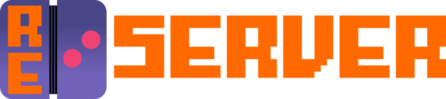

  

> [!NOTE]
> **This is not an officially supported Nitrome Ltd. or Infrared5 Inc. product.**

# Retouched Server
A reverse engineered implementation of the Brass Monkey server in Rust.

## Platform Support

|         | x86 | x86_64 | arm32 | arm64 |
|---------|:---:|:------:|:-----:|:-----:|
| Windows | ⚠️  | ✅     | N/A   | ✅    |
| Linux   | ⚠️  | ✅     | ⚠️    | ✅    |
| macOS   | N/A | ✅     | N/A   | ✅    |

✅ GUI &nbsp; ⚠️ CLI only

## Installation
Windows:
- Download and extract the zip. An installer is planned.
- You might have to press "Run anyway" from SmartScreen.

Linux:
- The appimage is recommended. Glibc 2.39+ is required (musl is unsupported -> use a compat layer).
- Qt 6.3 or higher required.

macOS:
- Open the dmg and drag the icon into the Applications folder.
- You will have to open the Apps folder with Finder separately for now.
- You will have to allow the app to be run from Settings.

## TODO
- [X] Make sure all targets can be built from GitHub actions and they work. (v1.0.0 requirement)
- [X] AUR packaging (x86_64 only)
- [X] Add an about page. (v1.0.1)
- [X] Improve Retouched Web update UX. (v2.0.0)
- [ ] Update checker
- [ ] Switch from polling to pushing updates to the Qt GUI.
- [ ] Binary signing
- [ ] Windows installer
- [ ] Better macOS dmg with drag and drop and background

## License

This project is licensed under the AGPL-3.0 License.  
See the [LICENSE](LICENSE) file for details.

Images in this repository are licensed under the Creative Commons Attribution 4.0 International License.  
See the [LICENSE-IMAGES.md](LICENSE-IMAGES.md) file for details.
